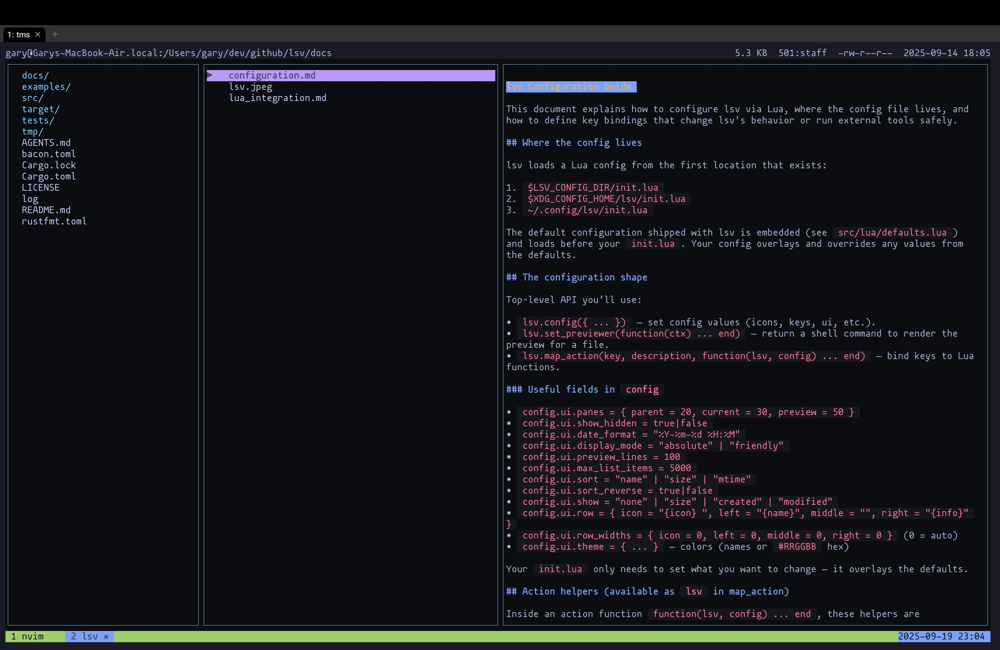

# lsv — A Three‑Pane Terminal File Viewer

[](https://github.com/SecretDeveloper/lsv/actions/workflows/ci.yml)
[](https://crates.io/crates/lsv)
[](https://docs.rs/lsv)
[](LICENSE)



lsv is a fast, curses‑based file viewer for the terminal. It presents three panes side by side:

- Parent: shows the contents of the parent directory of your current location.
- Current: shows the contents of the current directory with selection and navigation.
- Preview: shows a preview of the selected file (via a user‑defined preview command), or the entries of a selected directory.

The app is keyboard‑driven, configurable via Lua, and supports rich, ANSI‑colored previews from external tools (e.g., bat, glow).

## Install

- From crates.io: `cargo install lsv`

See the [documentation overview](docs/README.md) for setup guides, configuration reference, keybindings, and troubleshooting tips.

## Build & Run (from source)

- Requires the Rust nightly toolchain (repo pins via `rust-toolchain.toml`). Install with `rustup toolchain install nightly` if you don't have it yet.
- Components `rustfmt` and `clippy` are listed in `rust-toolchain.toml`; `rustup` installs them automatically when you run the commands below.

- Build: `cargo build`
- Run: `cargo run`
- Optional trace logging: `LSV_TRACE=1 LSV_TRACE_FILE=/tmp/lsv-trace.log cargo run`

## Navigation (defaults)

- Up/Down or k/j: move selection in the Current pane
- Right or Enter: enter selected directory
- Left or Backspace: go to parent directory (reselect the dir you just left)
- q or Esc: quit
 - ?: toggle which‑key overlay (shows grouped keybindings)

## Configuration Overview

lsv loads a Lua config from the first of:

1. `$LSV_CONFIG_DIR/init.lua`
2. `$XDG_CONFIG_HOME/lsv/init.lua`
3. `~/.config/lsv/init.lua`

Top‑level Lua API:

- `lsv.config({ ... })`: core settings (icons, keys, ui, etc.).
- `lsv.set_previewer(function(ctx) ... end)`: return a shell command to render preview.
- `lsv.map_action(key, description, function(lsv, config) ... end)`: bind keys to Lua functions.

Action helper functions available on `lsv` inside actions:

- `lsv.select_item(index)`: set the current selection to `index` (0-based).
- `lsv.select_last_item()`: select the last item in the current list.
- `lsv.quit()`: request the app to exit.
- `lsv.display_output(text, title?)`: show text in a bottom Output panel.
- `lsv.os_run(cmd)`: run a shell command and show its captured output in the Output panel. Env includes `LSV_PATH`, `LSV_DIR`, `LSV_NAME`.

Context data passed to actions via `config.context`:

- `cwd`: current working directory.
- `selected_index`: current selection index (or a sentinel if none).
- `current_len`: number of items in the current list.
- `path`: absolute path of the selected entry (falls back to `cwd`).
- `parent_dir`: parent directory of the selected entry (falls back to `cwd`).
- `name`: file name (basename) of the selected entry, when available.

### Minimal Example: Bind an external tool

```lua
-- Sample lsv config — place in $HOME/.config/lsv/init.lua
lsv.config({
  config_version = 1,
  keys = { sequence_timeout_ms = 0 },

  ui = {
    panes = { parent = 20, current = 30, preview = 50 },
    show_hidden = true,
    date_format = "%Y-%m-%d %H:%M",
    display_mode = "absolute",   -- or "friendly" (affects both dates and sizes)
    theme_path = "themes/dark.lua",  -- swap to "themes/light.lua" or any palette under themes/

    -- Optional row layout: icon/left/middle/right with placeholders
    row = {
      icon = "{icon} ",
      left = "{name}",
      middle = "",
      right = "{info}",
    },
  },
})

-- Safe shell quote helper
local function shquote(s)
  return "'" .. tostring(s):gsub("'", "'\\''") .. "'"
end

-- Example: bind "gs" to git status of the current directory
lsv.map_action("gs", "Git Status", function(lsv, config)
  local dir = (config.context and config.context.cwd) or "."
  lsv.os_run("git -C " .. shquote(dir) .. " status")
end)

-- Previewer function (ctx):
-- ctx = {
--   path       = absolute file path (string)
--   directory  = parent directory (string)
--   extension  = file extension without dot (string, may be empty)
--   is_binary  = boolean (simple heuristic)
--   height     = preview pane height in rows (number)
--   width      = preview pane width in columns (number)
--   preview_x  = top-left x of preview pane (number)
--   preview_y  = top-left y of preview pane (number)
-- }
-- Return a shell command string (placeholders are expanded: {path},{directory},{name},{extension}), or nil to use default head preview.
lsv.set_previewer(function(ctx)
	-- Render Markdown with glow, respecting pane width
	if ctx.extension == "md" or ctx.extension == "markdown" then
		-- You can build a command with placeholders:
		return "glow --style=dark --width=" .. tostring(ctx.width) .. " {path}"
	end

	if
		ctx.extension == "jpg"
		or ctx.extension == "jpeg"
		or ctx.extension == "png"
		or ctx.extension == "gif"
		or ctx.extension == "bmp"
		or ctx.extension == "tiff"
	then
		-- image preview using viu (needs installation)
		return "viu --width '{width}' --height '{height}' '{path}'"
	end
	-- For non-binary, colorize with bat (first 120 lines, no wrapping)
	if not ctx.is_binary then
		return "bat --color=always --style=numbers --paging=never --wrap=never --line-range=:120 {path}"
	end

	-- Fallback to default preview (first N lines)
	return nil
end)
```

### Keybindings: Actions

- Bind with `lsv.map_action(key, description, function(lsv, config) ... end)`.
- Prefer mutating `config` (e.g., `config.ui.sort = "size"`) and using helpers like `lsv.select_item(...)`.

Default action bindings

- Sorting: `sn` (by name), `ss` (by size), `sr` (toggle reverse)
- Info field: `zn` (none), `zs` (size), `zc` (created)
- Display mode: `zf` (friendly), `za` (absolute)
- Navigation: `gg` (top), `G` (bottom)
- Overlays: `zm` (toggle messages), `zo` (toggle last output), `?` (which‑key)

Override example

```lua
-- Change the default for "ss" to also show sizes in the info column
lsv.map_action("ss", "Sort by size + show size", function(lsv, config)
  config.ui.sort = "size"
  config.ui.show = "size"
end)
```

### Which‑Key Overlay and Sequences

- Type `?` to toggle a bottom overlay listing available keys (uses descriptions).
- Composite sequences are supported (e.g., `ss`, `zc`). The overlay opens automatically when you type a registered prefix.
- Timeout: by default there is no timeout for multi‑key sequences (0).
  - To enable a timeout, set `keys.sequence_timeout_ms` in your Lua config:
    
    ```lua
    lsv.config({
      keys = { sequence_timeout_ms = 600 },  -- 600ms timeout for sequences
    })
    ```

### Row Layout (icon/left/right)

Configure row sections under `ui.row`:

- Templates accept placeholders `{icon}`, `{name}`, `{info}`.
- Right column is right‑aligned, left is left‑aligned.

### Rendering Modes and Formats

- Dates: `display:absolute` uses `ui.date_format` (default `%Y-%m-%d %H:%M`); `display:friendly` uses relative strings (e.g., `3d ago`).
- Sizes: `display:absolute` shows raw bytes with `B`; `display:friendly` uses human units (KB/MB/...).

### Placeholders (expanded in preview and commands)

- `{path}`: absolute file path
- `{directory}` (alias `{dir}`): parent directory
- `{name}`: basename of file
- `{extension}`: extension without dot
- `{width}`, `{height}`: preview pane size in characters
- `{preview_x}`, `{preview_y}`: preview pane top‑left coordinates
- `$f`: shorthand for `{path}`

Environment for external commands:
- `LSV_PATH` (selected file), `LSV_DIR` (directory), `LSV_NAME` (basename)

### Preview Notes

- lsv captures the command’s output and renders ANSI colors (SGR). If your tool disables color when piped, add `--color=always` (bat) or set styles (glow). lsv sets `FORCE_COLOR=1` and `CLICOLOR_FORCE=1` for preview commands.
- For very large outputs, lsv trims to `ui.preview_lines` lines.

## Tracing (debugging)

- Enable with `LSV_TRACE=1` (default log path: `$TMPDIR/lsv-trace.log` or `/tmp/lsv-trace.log`).
- Override path with `LSV_TRACE_FILE=/path/to/log`.
- Logs include executed commands, exit codes, bytes written, and a snippet of preview output.

## Status

- Legacy configuration methods are removed. Use the Lua APIs described above.
- Planned: robust MIME detection (optional), async preview.
