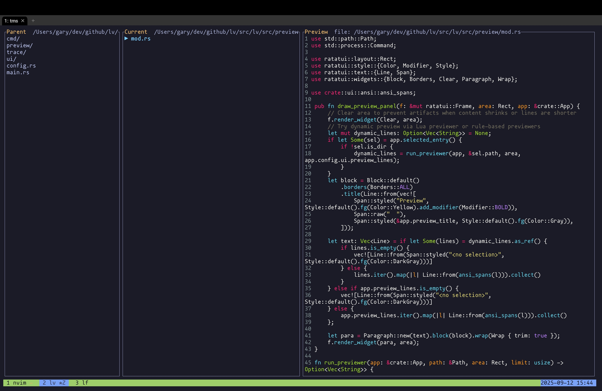

# lv — A Three‑Pane Terminal File Viewer



lv is a fast, curses‑based file viewer for the terminal. It presents three panes side by side:

- Parent: shows the contents of the parent directory of your current location.
- Current: shows the contents of the current directory with selection and navigation.
- Preview: shows a preview of the selected file (via a user‑defined preview command), or the entries of a selected directory.

The app is keyboard‑driven, configurable via Lua, and supports rich, ANSI‑colored previews from external tools (e.g., bat, glow).

## Build & Run

- Build: `cargo build -p lv`
- Run: `cargo run -p lv`
- Optional trace logging: `LV_TRACE=1 LV_TRACE_FILE=/tmp/lv-trace.log cargo run -p lv`

## Navigation (defaults)

- Up/Down or k/j: move selection in the Current pane
- Right or Enter: enter selected directory
- Left or Backspace: go to parent directory (reselect the dir you just left)
- q or Esc: quit

## Configuration Overview

lv loads a Lua config from the first of:

1. `$LV_CONFIG_DIR/lua/init.lua`
2. `$XDG_CONFIG_HOME/lv/lua/init.lua`
3. `~/.config/lv/lua/init.lua`

Top‑level Lua API:

- `lv.config({ ... })`: core settings (icons, ui, keys, commands)
- `lv.mapkey(sequence, action, description?)`: bind keys/sequences to actions
- `lv.set_previewer(function(ctx) ... end)`: return a shell command to render preview

Only the new Lua function approach is supported (no legacy config files/lists).

### Example (based on test-config/config1/lua/init.lua)

```lua
lv.config({
  config_version = 1,
  icons = { enabled = true, preset = "nerd", font = "Mononokai Nerd Font" },
  keys = { sequence_timeout_ms = 500 },
  commands = {
    { description = "Open selected in new tmux pane", keymap = "E", cmd = "&tmux split-window -h nvim '{path}'" },
    { description = "Open selected in editor", keymap = "e", cmd = "nvim '{path}'" },
    { description = "Open current dir in new tmux window", keymap = "t", cmd = "tmux new-window -c {directory}" },
  },
  ui = {
    panes = { parent = 20, current = 30, preview = 50 },
    show_hidden = true,
  },
})

-- Previewer function: ctx → command or nil (fallback to simple preview)
-- ctx = { path, directory, extension, is_binary, height, width, preview_x, preview_y }
lv.set_previewer(function(ctx)
  if ctx.extension == "md" or ctx.extension == "markdown" then
    return "glow --style=dark --width=" .. tostring(ctx.width) .. " {path}"
  end
  if not ctx.is_binary then
    return "bat --color=always --style=plain --paging=never --wrap=never --line-range=:120 {path}"
  end
  return nil
end)
```

### Placeholders (expanded in preview and commands)

- `{path}`: absolute file path
- `{directory}` (alias `{dir}`): parent directory
- `{name}`: basename of file
- `{extension}`: extension without dot
- `{width}`, `{height}`: preview pane size in characters
- `{preview_x}`, `{preview_y}`: preview pane top‑left coordinates
- `$f`: shorthand for `{path}`

### Preview Notes

- lv captures the command’s output and renders ANSI colors (SGR). If your tool disables color when piped, add `--color=always` (bat) or set styles (glow). lv sets `FORCE_COLOR=1` and `CLICOLOR_FORCE=1` for preview commands.
- For very large outputs, lv trims to `ui.preview_lines` lines.

## Tracing (debugging)

- Enable with `LV_TRACE=1` (default log path: `$TMPDIR/lv-trace.log` or `/tmp/lv-trace.log`).
- Override path with `LV_TRACE_FILE=/path/to/log`.
- Logs include executed commands, exit codes, bytes written, and a snippet of preview output.

## Status

- Legacy configuration methods are removed. Use the Lua APIs described above.
- Planned: which‑key overlay using descriptions, robust MIME detection (optional), async preview.
