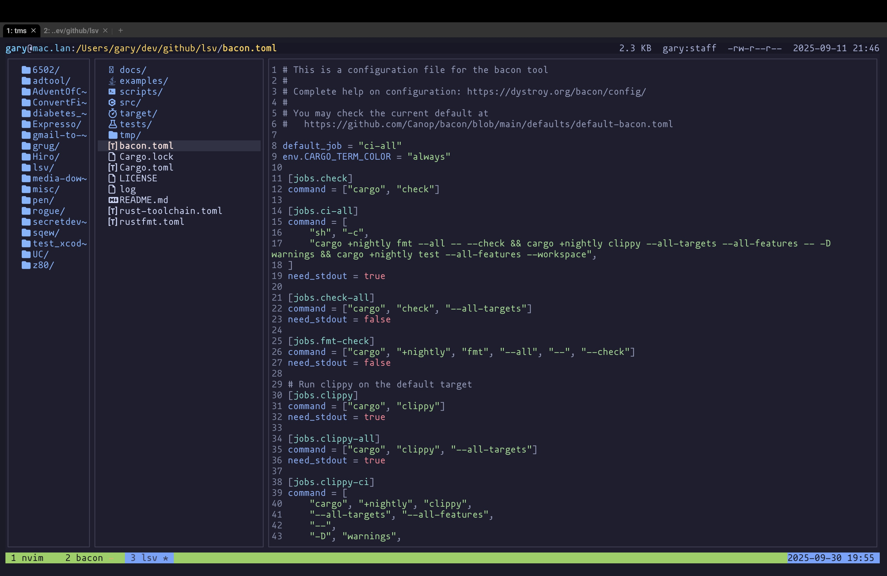
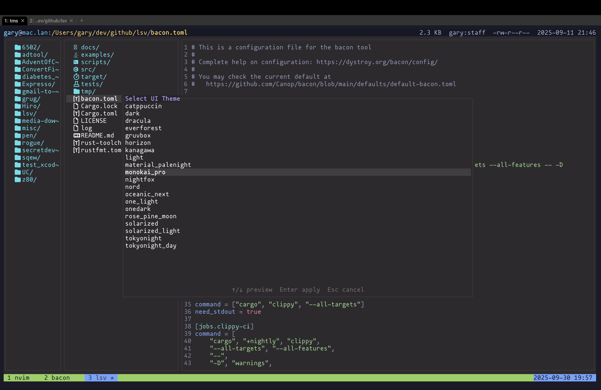

# lsv Documentation

Welcome to the documentation hub for **lsv**, the three-pane terminal file viewer.

## Contents

- [Getting Started](getting_started.md) — quick installation and first configuration.
- [Configuration Reference](configuration.md) — every tunable, the Lua API, and examples.
- [Default Keybindings](keybindings.md) — tables of shipped shortcuts.
- [Lua Integration](lua_integration.md) — deep dive into the Rust/Lua bridge.
- [Command Palette](command_palette.md) — use the ":" prompt, suggestions, and Tab-completion.
- [Troubleshooting](troubleshooting.md) — diagnose preview failures, platform quirks, tracing tips.

## Capabilities

- Three‑pane navigation (parent/current/preview) with fast sorting and filtering
- Keyboard‑driven UX with multi‑key sequences and a which‑key overlay
- Lua configuration: themes, keymaps, actions, programmable previewer
- External commands: captured output (`os_run`) or interactive (`os_run_interactive`)
- File operations: add, rename, delete; multi‑select with copy/move/paste
- Marks: save and jump to directories with single keystrokes
- Display modes: absolute vs. friendly sizes/dates; toggle hidden files
- Command palette (`:`) with suggestions and Tab‑completion
