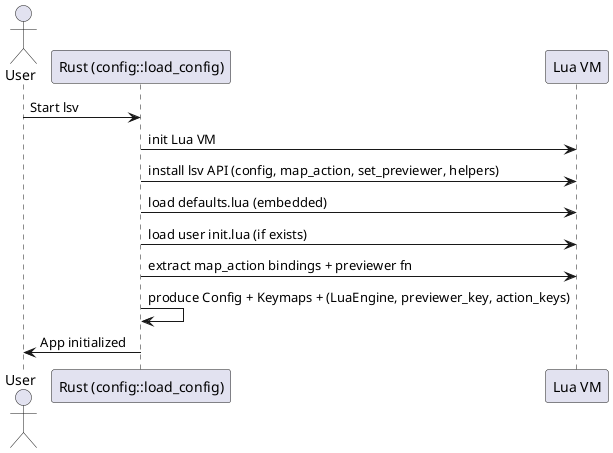
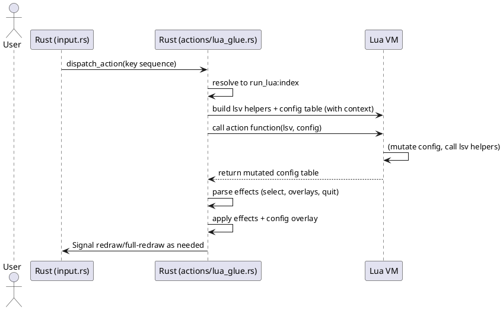
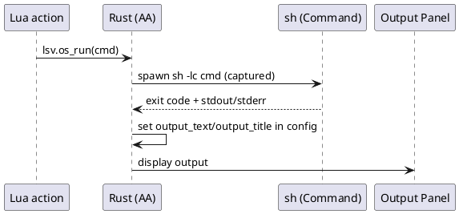
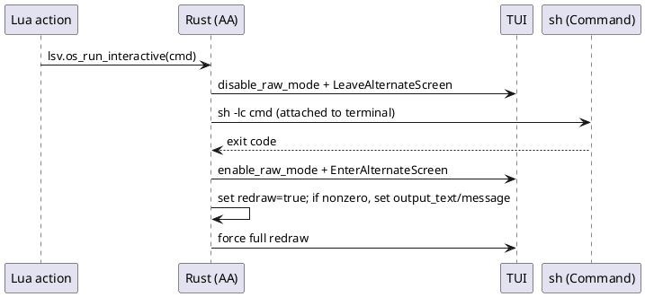
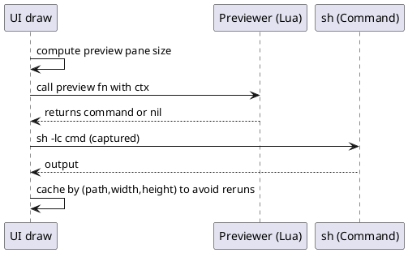

# Lua Configuration and Action Flow in lsv

This document explains how Lua configuration integrates with the Rust core. It covers what gets loaded at startup, how key bindings call Lua functions, how those functions communicate intent back to Rust, and how external commands and previewers are executed.

The diagrams use PlantUML (sequence diagrams). You can paste the code blocks into any PlantUML renderer to visualize them.

## Overview

- Defaults are embedded in the binary (`src/lua/defaults.lua`) and loaded first.
- User config (`$LSV_CONFIG_DIR/init.lua`, `$XDG_CONFIG_HOME/lsv/init.lua`, or `~/.config/lsv/init.lua`) is loaded next and overlays values.
  - You may place reusable Lua modules under `lua/` next to `init.lua` and load them via `require("module_name")`.
- Keys are bound via `lsv.map_action(key, description, function(lsv, config) ... end)`.
- At runtime, a key press resolves to either:
  - A Lua action function (recommended), or
  - An internal action (sorting, etc.).
- Lua actions receive:
  - `lsv`: helper functions that can request navigation, output display, interactive/captured command execution, or quit.
  - `config`: a table representing the current configuration and a `context` subtable with current state.
- Lua returns an updated `config` (optionally with flags like `output_text`, `messages`, `redraw`), and Rust applies the changes and repaints the UI.

## Startup Load Sequence

Key points:
- Defaults never hard-code user-specific actions (like external tools). Those belong in user init.lua.
- User config overlays defaults (only provided fields are changed).

## Key Press to Action Function

Notes:
- `config.context` includes: `cwd`, `selected_index`, `current_len`.
- `lsv` helpers can set fields like `output_text`, `output_title`, `messages`, or `redraw` in the config table; Rust applies them.

## lsv Helper Functions

Helpers injected into Lua action functions:

- `lsv.select_item(index)`: select an item by index (0-based).
- `lsv.select_last_item()`: select the last item.
- `lsv.quit()`: set a quit flag.
- `lsv.display_output(text, title?)`: show text in Output panel.
- `lsv.os_run(cmd)`: run a command (captured) and display stdout+stderr in Output.
- `lsv.os_run_interactive(cmd)`: suspend TUI, run command attached to terminal, restore TUI, then request a full redraw.

### Captured Command (os_run)

- Use for non-interactive tools (git status, grep, etc.).
- Trace logs show cmd, cwd, env, exit code, and bytes of output when `LSV_TRACE=1`.

### Interactive Command (os_run_interactive)

- Use for editors and pagers (nvim, vi, less, tmux, etc.).
- Returning to TUI triggers a full rerender to avoid a blank screen.

## Previewer Flow

- The previewer is optional. If nil is returned, lsv falls back to a simple head preview.
- Output is cached by `(selected path, width, height)`. Selection/resize invalidates cache.

## Error and Message Handling

- Command errors:
  - Interactive: on non-zero exit, a short note is recorded and shown in the Output panel.
  - Captured: spawn errors are recorded as messages; stdout/stderr are shown in Output panel.
- Messages panel (toggle `zm`) shows recent messages (e.g., command failures), with rolling history.
- Overlays (which-key, messages, output) are mutually exclusive.

## Tracing (diagnostics)

Set `LSV_TRACE=1` to log to `/tmp/lsv-trace.log` (or `LSV_TRACE_FILE=/path/to/log`).
- Logs include:
  - Lua action calls: start, errors, and runtime in ms
  - os_run/os_run_interactive calls: cmd, cwd, env, exit code, output sizes
  - Preview commands: cmd, exit code, bytes out

This helps identify crashes or slow paths — especially when calling external tools or previewers.

## Security Notes

- lsv executes shell commands only as requested by your Lua actions or preview functions.
- Use quoting helpers in Lua (e.g., `shquote`) to avoid unintended shell expansion.
- Prefer read-only tools in previewers to avoid accidental modification of files.

---

If you have ideas or want to visualize additional flows, add new PlantUML snippets in this document.
